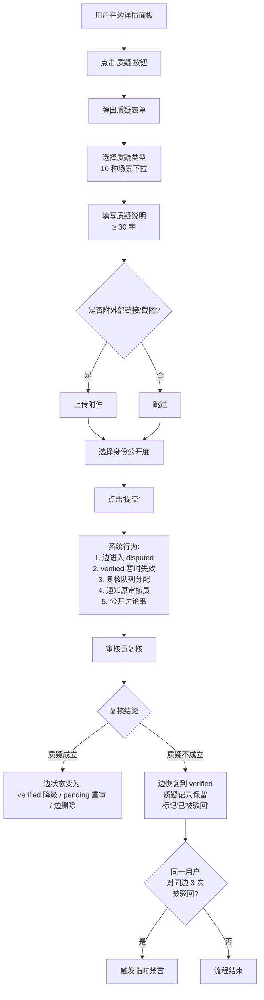

# 万源图谱质疑者手册

> **版本**：v0.1 草案
> **最后更新**：2026-06-28
> **状态**：待用户确认

---

## 文档元信息（待用户确认项）

1. 质疑类型的英文枚举值（`evidence_unavailable` / `source_misquote` / `granularity_wrong` / `outdated_source` / `direction_reversed` / `relation_type_wrong` / `general_doubt` 等）是否需要与 schema 字段对齐（当前 schema 中 `relation_type` 是受控枚举，质疑类型尚未在 schema 中定义）。
2. 质疑触发后是否需要新增 schema 字段记录：`disputed_at`、`disputed_by`、`dispute_thread_id`、原 `verification_status` 备份。
3. 匿名质疑的可见范围（仅审核员可见 / 全部隐藏身份 / 显示为"匿名用户"）待产品决策。
4. 重复质疑被驳回 3 次触发临时禁言的具体时长（24h / 7d / 30d）待产品决策。
5. "高风险边"的判定阈值（被质疑 N 次、N 天内）待算法侧确定。
6. 跨用户合并讨论串的产品 UI 形态（线性 / 树状）待设计确认。
7. 申诉流程是否独立成另一份手册（当前仅占位提及"另行设计"）。
8. 质疑记录对"原审核员"的通知渠道（站内信 / 邮件 / 移动推送）待运营确认。

---

## 第一部分：质疑者的角色与责任

### 1.1 谁可以质疑

任意已注册用户。无需行业资质、无需审核员背书、无需提交证明材料。万源图谱相信 **"疑点本身是一种信息"** —— 一个外行觉得"哪儿不对"的感觉，可能恰好命中了内行因熟视无睹而漏看的盲区。

### 1.2 质疑的成本

成本极低：
- 一份 ≥ 30 字的疑点说明
- 选择一个质疑类型标签
- 一次性点击提交

无需举证，无需自证资质。**举证是审核员复核阶段的事，不是质疑者的事。**

### 1.3 质疑的能力边界

质疑者**可以**触发：

- 目标边的 `verification_status` 从 `verified` 降为 `disputed`（待 schema 扩展）
- 边被冻结，进入复核队列
- 公开讨论串开启，其他用户可附议
- 原审核员收到通知

质疑者**不可以**直接：

- 删除边
- 修改边的 source / target / relation_type / evidence 内容
- 修改其他用户的质疑记录
- 关闭或合并讨论串
- 判定任何一方的对错

### 1.4 质疑者不是终审者

质疑是 **流程触发器**，不是 **判决书**。它把边从"已确认"转入"待复核"，由具有判断资质的审核员在复核阶段给出最终结论。质疑者提供的是"这里可能有错"的信号，不是"这里就是错"的裁定。

### 1.5 重复质疑合并

同一边的多次质疑自动合并到同一条讨论串（按 `edge_id` 聚合）。即使有 100 个用户对同一条边提出质疑，也只触发 **一次** 复核流程。讨论串按时间顺序展示所有质疑理由，附议者可点"我也觉得有问题"按钮表达支持。

---

## 第二部分：什么时候应该质疑

以下 10 个场景覆盖了图谱日常质疑的主要入口：

### 场景 1：evidence 链接失效
边的 `evidence` 数组中至少一条来源的 URL 不可访问（404 / 403 / 域名过期）。这条边的真实性失去了可追溯的基础。

### 场景 2：源内容与边声明不符
evidence 引用的标准 / 报告 / 页面，原文讲的是 A，边描述里却写成了 B。属于典型的"原文不存在该结论"或"原文讲的是反例"。

### 场景 3：关系方向反
`source` 和 `target` 写反了。例如把"电池片 → 组件"误写为"组件 → 电池片"。

### 场景 4：粒度不当
节点定义范围过粗或过细。例如把"电池片"作为一个笼统节点，而本图谱应在该层级区分"晶硅电池片 / 薄膜电池片 / 钙钛矿电池片"。

### 场景 5：关系类型错
使用了 `raw_material_for`，但实际上该关系是 `consumable_for` / `equipment_for` / `applied_in` 等。例如把辅料（消耗品）当成原料。

### 场景 6：节点定义模糊
`Node.definition` 写得不够精确，导致多人对"这个节点指什么"理解不一致。

### 场景 7：标准已更新但边未更新
边引用的标准已被新版本替代（如 T/CPIA 0030.2-2021 → 2025 版），但边未同步更新证据。

### 场景 8：明显错误
把不属于本产业 / 本语境 / 本概念边界的边错连进来。例如把"医用手套"和"光伏组件"之间画了一条"原料供应"边。

### 场景 9：跨语境歧义
同一术语在不同行业 / 地区含义不同，本边未在 `aliases[].context` 中标注语境，导致歧义。

### 场景 10："感觉不对"但说不出原因
说不出具体证据，但就是"看着别扭"。这种直觉性的质疑同样是合法入口 —— 它交给审核员去判断究竟是用户对、还是用户对图谱的认知模型有偏差。

---

## 第三部分：质疑的标准操作流程（SOP）

### 3.1 流程图（mermaid）

### 3.2 详细步骤

**步骤 1：进入质疑界面**
- 任意边的详情面板右下角有红色"质疑"按钮
- 点击后弹出 modal 表单

**步骤 2：填写质疑表单**
- 质疑类型（必填，下拉选择，10 种场景 + 兜底的"其他"）
- 质疑说明（必填，多行文本，≥ 30 字）
- 外部链接 / 截图（可选，支持 PNG / JPG / PDF）
- 身份声明（可选：行业从业者 / 普通用户 / 匿名）

**步骤 3：提交**
- 点击"提交"按钮
- 系统即时执行 4 个动作（见流程图 K 节点）

**步骤 4：跟进**
- 质疑记录出现在该边的"质疑历史"列表
- 讨论串对所有用户可见
- 复核完成后，质疑者收到站内通知

### 3.3 质疑被驳回的处理

| 情形 | 系统行为 |
|------|---------|
| 复核后质疑不成立 | 边恢复到原 `verified` 状态 |
| 质疑记录 | **保留**，附"已被驳回"标记 |
| 同一用户对同边 ≥ 3 次被驳回 | 触发临时禁言（时长待定） |
| 同一用户对不同边累计被驳回 ≥ 10 次 / 月 | 触发审核员重点关注该账号 |

---

## 第四部分：质疑的常见类型与示例

### 案例 1：evidence 失效（对应场景 1）

> **边**：`硅料 → 硅片 raw_material_for`
> **evidence**：链接到某国标 GB/T XXXXX-2018 全文页面
> **用户点击**：404
> **质疑类型**：`evidence_unavailable`
> **质疑说明**：原国标已被 GB/T XXXXX-2023 替代，原链接已失效。建议更新 evidence 至 2023 版，并补一条"国标名称 + 替代关系说明"的引用。
> **审核员复核要点**：是否真的被替代？替代版本的覆盖范围是否一致？

### 案例 2：源内容不符（对应场景 2）

> **边**：`白银行业 → 光伏产业 raw_material_for`
> **evidence**：某券商深度研报 URL
> **用户通读**：研报原意是"白银工业用途分布"，其中光伏应用仅占 8%，排在电子电气（43%）、摄影（15%）、钎焊焊料（11%）之后，作为"次要且高弹性"应用。
> **质疑类型**：`source_misquote`
> **质疑说明**：原文未将光伏定义为核心供应链，而是作为"价格弹性"应用场景讨论，不构成 `raw_material_for`（核心原料关系）的证据。建议改为 `applied_in`（应用场景之一），并补充 evidence 中原文段落标注。
> **审核员复核要点**：原文是否支持核心关系的断言？若仅是次要应用，关系类型应弱化。

### 案例 3：粒度不当（对应场景 4）

> **边**：`组件 → 发电 applied_in`
> **用户指出**：组件是光伏发电系统的核心部件，"应用于发电"在语义上不准确 —— 组件不是"被用于"发电，而是"组成"发电系统。
> **质疑类型**：`granularity_wrong`
> **质疑说明**：建议将该边关系类型改为 `made_of`（"由组件构成"），或保留 `applied_in` 但补充 note 说明"指作为发电系统子部件"。组件本身的粒度也需要讨论 —— 当前节点未区分"晶硅组件 / 薄膜组件"，建议拆分为子节点。
> **审核员复核要点**：节点粒度是否符合 v0.3 schema 中"节点只回答'是什么'、关系才表达归属"的原则？

### 案例 4：标准已更新（对应场景 7）

> **边**：`银浆 → 电池片 consumable_for`
> **evidence**：T/CPIA 0030.2-2021《光伏银浆》
> **用户指出**：T/CPIA 0030.2-2025 已于 2025 年 6 月发布，对银浆含银量定义、烧结温度区间均有调整。
> **质疑类型**：`outdated_source`
> **质疑说明**：建议更新 evidence 至 2025 版，并在 note 中说明"2021 版数据在 2025 版发布后已不构成当前最佳依据，但作为历史标准仍可参考"。
> **审核员复核要点**：2025 版是否真的替代了 2021 版（部分标准是并行有效，部分是替代）？旧标准链接是否需保留以体现"曾依据"的历史？

### 案例 5：方向反（对应场景 3）

> **边**：`组件 → 电池片 made_of`
> **实际**：应为 `电池片 → 组件 made_of`
> **质疑类型**：`direction_reversed`
> **质疑说明**：电池片是组件的子部件，组件由多个电池片串并联构成。`made_of` 关系的方向应从子部件指向母体，即"电池片 → 组件"。
> **审核员复核要点**：依据 v0.3 schema 中 `made_of` 的定义（"由某材料构成"），其语义是 A 由 B 构成时应写为 `B → A made_of`。

### 案例 6：关系类型错（对应场景 5）

> **边**：`银浆 → 电池片 raw_material_for`
> **用户指出**：银浆是辅料（消耗品）而非原料。在电池片生产中，银浆通过印刷工艺涂覆在硅片表面，烧结后形成电极，其作用是"参与工艺的消耗性物料"，不是"构成电池片本体的核心原料"。
> **质疑类型**：`relation_type_wrong`
> **质疑说明**：建议改为 `consumable_for`。补充：在多主栅技术中，银浆的消耗量直接影响电池片成本结构，作为 `consumable_for` 更能体现其经济含义。
> **审核员复核要点**：v0.3 schema 中 `consumable_for` 与 `raw_material_for` 的边界 —— 前者强调"工艺过程中的消耗"，后者强调"产品本体的构成"。

### 案例 7："感觉不对"（对应场景 10）

> **边**：`光伏 → 半导体 industry_supports`
> **用户没有具体证据**，但觉得"光伏支持半导体"这个关系说不通。
> **质疑类型**：`general_doubt`
> **质疑说明**：光伏和半导体更多是技术借鉴关系（薄膜沉积、刻蚀等工艺设备有交叉），不是支撑关系。"支撑"在产业链语境下通常指上游对下游的供给能力，光伏行业并不构成对半导体行业的供给。建议：①拆分或改类型为 `structurally_similar_to`（横向相似）；②若坚持产业关系，应明确"支撑"的具体维度（设备 / 工艺 / 材料）。
> **审核员复核要点**：用户的"感觉"是否对应了具体的语义模糊？若关系定义本身需要澄清，应归类为"关系类型需细化"而非"用户认知偏差"。

> **附注**：场景 6（节点定义模糊）、场景 8（明显错误）、场景 9（跨语境歧义）由于其性质，更适合作为 **节点级质疑** 而非边级质疑触发，本手册聚焦边质疑。节点质疑流程将在《节点维护手册》中单独定义。

---

## 第五部分：质疑的礼仪与社区规范

### 5.1 对事不对人
质疑的是 **边** 和 **审核判定**，不是 **审核员本人**。讨论中使用"这条边的证据似乎不充分"，而不是"你这条边的审核不认真"。

### 5.2 提供依据优先
有依据的质疑更易被审核员优先处理。提供链接、原文截图、数据出处都能显著提高质疑的复权重。**但无依据不等于无效质疑** —— "感觉不对"同样是合法入口。

### 5.3 接受驳回
被驳回后可走申诉流程（流程另行设计），但申诉应聚焦"我提供的证据未被充分考虑"，不应聚焦"审核员故意刁难我"。

### 5.4 避免无意义质疑
连续对不构成实质问题的边发起质疑，会被视为骚扰。系统会统计账号维度的"质疑频次 / 驳回率"，高驳回率账号的质疑将进入审核员重点复核队列。

### 5.5 善意原则
默认假设所有贡献者（审核员、原始编辑者、附议者）的出发点都是善意的。疑点的表述要明确、具体、可验证，不使用情绪化语言。

---

## 第六部分：质疑数据的价值

质疑不仅是修正工具，也是 **图谱质量的诊断信号**。

### 6.1 频次统计
某条边在 30 天内被质疑 ≥ 5 次 → 系统自动标记为"高风险边"，在详情面板顶部显示警告标签。高风险边会被优先分配给资深审核员复核。

### 6.2 类型分布
某审核员经手的边被质疑"粒度不当"占比 ≥ 30% → 系统向审核员培训团队发送提示，建议复审培训。类似地：
- "方向反"占比高 → 提示对方向规则理解需加强
- "标准已更新"占比高 → 提示 evidence 时效性管理需加强

### 6.3 公众监督
所有质疑记录对所有用户透明（匿名质疑的隐私字段除外），形成 **自下而上的质量监督网络**。这与万源图谱核心理念第六章"把分类权力交还给使用者"一脉相承 —— 质疑机制是用户行使质量监督权力的具体入口。

### 6.4 趋势分析
系统提供质疑数据的开放 API，供研究者分析"哪些产业、哪些关系类型最容易出错"，反哺图谱编辑流程优化。

---

## 第七部分：FAQ

**Q1：我不是行业专家，我的质疑有用吗？**
A：有用。v0.3 schema 明确禁止 AI 自填 `verification_status`，但同时也承认：审核员可能漏看、源可能陈旧、标准可能更新。质疑机制的合法性来源不是"质疑者懂行"，而是"用户参与了质量控制"。外行的"看着别扭"可能是内行熟视无睹的盲区。

**Q2：质疑是否暴露给原审核员？会不会得罪人？**
A：质疑记录对原审核员可见（系统通知）。这是有意的设计 —— 审核员需要知道自己的判定被质疑，以便复盘改进。礼仪层面，质疑聚焦边本身而非审核员人格；制度层面，审核员被质疑 **不直接影响其信用评分**，影响评分的是"高驳回率"（即其审核的边被多人反复质疑）。

**Q3：我可以匿名质疑吗？**
A：可以。质疑表单提供"匿名"选项。匿名质疑的 `disputed_by` 字段记为 `null` 或 `anonymous_token`，但质疑内容（类型、说明、附件）对所有用户可见，仅身份字段被脱敏。

**Q4：质疑后多久能得到处理？**
A：当前目标 SLA：普通质疑 7 天内首次响应，复杂质疑（含节点级争议）14 天内首次响应。实际处理时长取决于审核员队列负载。

**Q5：质疑会影响审核员的信用吗？**
A：单次质疑不影响。审核员信用由"其审核的边被复核的频次"和"复核结果是否判定其判定有误"综合决定。质疑者 A 的一次质疑不会让审核员扣分；只有当复核结论认定"原审核有误"时，才会回溯到审核员信用。

**Q6：我可以撤回质疑吗？**
A：可以。质疑提交后 24 小时内可一键撤回，撤回后讨论串标记"质疑者已撤回"，但记录保留在审计日志中。24 小时后不再支持撤回（避免审核员已投入复核后被随意撤回）。

**Q7：多次被驳回后还能继续质疑吗？**
A：能，但会有额外摩擦。临时禁言到期后，该用户可继续质疑，但其后续质疑会被系统标记为"高历史驳回率账号"，进入审核员重点复核队列（不降优先级，但审核员会格外仔细查看）。

**Q8：我发现批量错误边（同一错误模式），该怎么处理？**
A：分两步：①先对其中一条发起质疑并附"批量模式"说明，系统会提示你"是否要将本质疑推广为模式质疑"；②模式质疑会触发批量复核流程，效率高于对每条边单独质疑。该功能待 v0.2 版本上线。

---

## 附：术语表

| 术语 | 含义 |
|------|------|
| verified | 边已通过审核员真伪判断 |
| proposed | 边有依据但未经验证 |
| disputed | 边被质疑，暂冻结进入复核 |
| evidence | 边或节点引用的证据来源 |
| 附议 | 在讨论串中对已有质疑表达支持 |
| 模式质疑 | 同一错误模式覆盖多条边时，触发批量复核 |

---

> **文档结束**。本手册为 v0.1 草案，待用户确认上述 8 项待确认项后，进入 v0.2 正式版编写。
